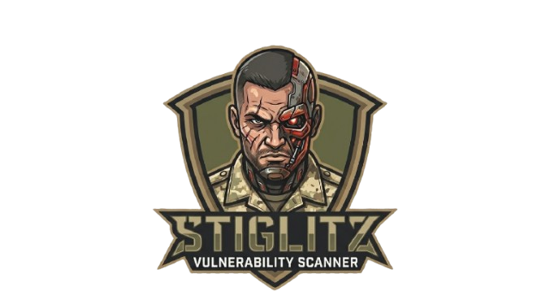

<p align="center">
  
</p>


<p align="center">
  <b>The all-in-one offensive security pipeline.</b><br>
  OSINT → Recon → Adaptive Scanning → Active Exploitation → Big4-grade reports — in one command.
</p>

<p align="center">
  <a href="https://www.gnu.org/software/bash/"></a>
  <a href="https://python.org"></a>
  <a href="https://github.com/trickMeister1337/Stiglitz/actions/workflows/ci.yml"></a>
  <a href="LICENSE"></a>
  
</p>

---

> ### ⚠ Authorized use only
> Stiglitz is offensive tooling for **authorized engagements** with a signed Rules of Engagement (RoE).
> Every script requires explicit confirmation before any active execution.
> Unauthorized use is a crime (Art. 154-A CP / CFAA / Computer Misuse Act).

---

## What is Stiglitz?

Stiglitz chains the tools a red-teamer already uses — `subfinder`, `httpx`, `nuclei`, `katana`, `testssl`, OWASP ZAP, `sqlmap`, `hydra`, Metasploit and more — into a single, coordinated pipeline. It doesn't just run them: it **reads the target**, tunes each tool to the detected stack, **actively confirms** what it finds, and produces a client-ready report with a defensible risk score.

```
┌──────────┐    ┌──────────┐    ┌──────────────┐    ┌──────────────┐
│ OSINT    │ →  │ Recon &  │ →  │ Active        │ →  │ Big4-grade   │
│ (passive)│    │ Scanning │    │ Exploitation  │    │ HTML report  │
└──────────┘    └──────────┘    └──────────────┘    └──────────────┘
  osint.sh        stiglitz.sh         stiglitz_red.sh        auto-generated

            stiglitz_full.sh  ── runs the whole chain in one command
```

## Why Stiglitz?

- **🎯 Adaptive scanning** — detects the target's stack (`httpx` tech-detect + path fingerprinting + version probes) and automatically tunes Nuclei tags, ffuf wordlists and CMS scanners. No manual configuration.
- **🔬 Active confirmation, not just alerts** — every eligible finding is re-executed with a reproducible `curl` PoC. The report distinguishes a **confirmed exploit** from a merely **verified** hardening issue.
- **📡 Out-of-Band confirmation for blind vulns** — `lib/oob.py` integrates a self-hosted `interactsh-client` to confirm SSRF, RCE and SSTI via correlated DNS/HTTP callbacks. SSTI fires payloads against eight engines (Log4j, Jinja2, Twig, ERB, Velocity, Smarty, Spring SpEL, FreeMarker). Enable with `INTERACTSH_SERVER=oast.yourcorp.tld` (and optional `INTERACTSH_TOKEN`, `OOB_WAIT=20`).
- **📊 A risk score you can defend** — KEV > EPSS > CVSS methodology. The CRITICAL band requires a real critical finding or a CVE under active exploitation (CISA KEV) — soft signals can't inflate it.
- **📁 Client-ready reports** — executive summary, scope & methodology, effort×impact prioritization matrix, evolution diff vs the last scan, CVSS vectors, and reproducible evidence. Plus `findings.json` for SIEM/Jira.
- **🧩 One pipeline, full kill chain** — passive OSINT feeds active recon, recon feeds exploitation, every stage hands structured data to the next.

## Quick start

**Docker (recommended — no host setup, pinned tooling):**

```bash
docker build -t stiglitz .
docker run --rm -v "$PWD/output:/scans" stiglitz https://target.com
# or with compose:
docker compose run --rm stiglitz https://target.com
```

**Native:**

```bash
git clone https://github.com/trickMeister1337/Stiglitz.git
cd Stiglitz
bash setup.sh                      # installs system + Go + Python tooling

bash stiglitz.sh https://target.com   # recon + adaptive scan + report
```

Output lands in `scan_<domain>_<timestamp>/` — open `stiglitz_report.html`
(and `findings.sarif` for GitHub code scanning / DefectDojo).

> The Docker image ships the core scan path (recon, adaptive Nuclei, TLS, JS,
> report/SARIF). Heavy/optional engines (OWASP ZAP, Metasploit, sqlmap, hydra)
> are not bundled; those phases are skipped gracefully when the tool is absent.

## Components

| Tool | Role | When to use |
|---|---|---|
| `osint.sh` | Pre-engagement intelligence (10 phases) — passive by default; cloud/takeover probes opt-in via `--active-cloud` | Before any active scan |
| `stiglitz.sh` | Recon & adaptive vulnerability scanning (11 phases) | Map the attack surface |
| `pipeline.py` | Phase-level orchestrator for the scan — real checkpoint, retry, resume | Long/flaky scans you want to resume |
| `stiglitz_red.sh` | Automated exploitation engine (8 phases) | After recon, or standalone |
| `stiglitz_full.sh` | End-to-end orchestrator (OSINT → scan → exploit) | One-command full engagement |
| `stiglitz_batch.sh` | Multi-target wrapper | Many targets in series |
| `stiglitz_diff.py` | Scan-to-scan comparison | Remediation tracking |
| `stiglitz_trend.py` | Cross-engagement longitudinal analysis (N scans) | Quarterly/yearly risk trend |
| `stiglitz_red_batch.sh` | Parallel exploit on multiple targets | Multi-target engagement |
| `email_spoof_poc.py` | SPF/DMARC/DKIM spoofing PoC — analytical verdict + forged-email delivery (RoE-gated) | Demonstrate email spoofing (Phase 8 follow-up) |
| `lib/bizlogic.py` (`lib/bizlogic.sh`) | Business-logic / authz tests — IDOR/BOLA, privesc, amount tampering, race & idempotency. Spec-driven via `bizlogic.yaml`; runs as a Stiglitz RED phase or standalone. Mutations gated by profile + sentinel + RoE (production = dry-run). | Fintech APIs: cross-tenant access & funds-movement abuse |

## The scan pipeline

```
[1]    Subdomain discovery    subfinder
[2]    Surface mapping        httpx (tech-detect) + nmap
[2.5]  WAF + tech profile     wafw00f + adaptive stack detection
[3]    TLS analysis           testssl (parallel with nuclei)
[4]    Vulnerability scan     nuclei (adaptive tags)
[5]    PoC confirmation       active re-execution (min 60% confidence)
[6]    CVE enrichment         NVD API v2 + EPSS + CISA KEV
[7]    WAF detection          wafw00f + passive evasion
[8]    Email security         SPF / DMARC / DKIM
[9]    ZAP active scan        Spider + Ajax + Active Scan
[10]   JS analysis            katana + secret detection
[10.5] Extra checks           ffuf (adaptive wordlist) + wpscan/joomscan/droopescan
[11]   Report                 HTML + technology inventory + findings.json
```

### Adaptive scanning in action

Stiglitz fingerprints the stack and reshapes the scan automatically:

```
httpx -tech-detect → "[WordPress:6.3, PHP:8.1, Nginx:1.18.0]"
katana URLs        → /wp-admin/, /actuator/, /_next/   (CMS/framework fingerprint)
HTTP probes        → /feed/, /CHANGELOG.txt, /actuator (confirmed version)
        ↓
tech_profile.json  → nuclei tags · ffuf wordlist · CMS scanner
```

| Detected stack | Extra Nuclei tags | ffuf wordlist | CMS scanner |
|---|---|---|---|
| WordPress | `wordpress, wp` | wp-admin, xmlrpc.php, wp-config backups | wpscan |
| Drupal | `drupal` | CHANGELOG.txt, sites/default, modules/ | droopescan |
| Joomla | `joomla` | administrator/, components/ | joomscan |
| Spring Boot | `spring, actuator` | /actuator/* (heapdump, env, shutdown) | — |
| Laravel | `laravel` | .env, telescope/, horizon/, storage/logs | — |
| Django | `django` | admin/, __debug__/, api/v1/ | — |
| Apache Struts | `struts` | *.action, struts2-showcase/ | — |

## What you get

| File | Contents |
|---|---|
| `stiglitz_report.html` | Full technical report — exec summary, methodology, tech inventory, prioritization matrix, scan diff, reproducible evidence |
| `executive_summary.html` | One-page risk summary for management |
| `findings.json` | Structured export for SIEM / Jira |
| `findings.sarif` | SARIF 2.1.0 — ingest into GitHub code scanning, DefectDojo, CI/CD |
| `raw/` | nuclei JSONL, ZAP alerts, TLS issues, tech_profile.json, JS analysis, CVE enrichment |

## Usage

```bash
# Recon + adaptive scan (most common)
bash stiglitz.sh https://target.com

# Reuse OSINT discovery (skips subfinder, feeds historical endpoints)
bash osint.sh target.com --shodan-key $KEY --github-token $TOKEN
bash stiglitz.sh target.com --osint-dir osint_target.com_*/

# Authenticated scan
bash stiglitz.sh https://target.com --token "eyJ..."

# Automated exploitation from a scan's output
bash stiglitz_red.sh -d scan_target.com_*/ -p staging

# Full engagement in one command
bash stiglitz_full.sh target.com

# Multiple targets
bash stiglitz_batch.sh -f targets.txt -p staging

# Email spoofing PoC — analytical verdict only (sends nothing)
python3 email_spoof_poc.py target.com
# Deliver a forged email as proof (opt-in, RoE-gated — prompts for "EU AUTORIZO")
python3 email_spoof_poc.py target.com --send --to victim@org.com

# Business-logic / authz tests (IDOR/BOLA, privesc, amount tampering, race/idempotency)
cp bizlogic.example.yaml bizlogic.yaml   # fill in disposable test accounts + endpoints
python3 lib/bizlogic.py --config bizlogic.yaml --scope target.com --profile staging --outdir scan_dir/
# production = dry-run (verdict, no state change); lab/staging mutate and prompt for "EU AUTORIZO"
```

### Orchestrated scan with checkpoint & resume

`pipeline.py` drives the 11 scan phases as resumable units. If a long scan is
interrupted (or a phase fails), re-running it skips everything already completed
instead of starting over — the resume that the plain shell script only pretended
to have. Phase work itself stays in `stiglitz.sh`; the orchestrator only sequences
it, with per-phase retry and a dry-run plan.

```bash
# Full scan via the orchestrator (creates scan_<domain>_<ts>/)
python3 pipeline.py https://target.com

# Show the execution plan without running anything
python3 pipeline.py https://target.com --dry-run

# Resume an interrupted scan — completed phases are skipped
python3 pipeline.py https://target.com --outdir scan_target.com_20260524_120000

# Retry each phase up to 2 extra times on failure; run only a subset
python3 pipeline.py https://target.com --retries 2 --only P1,P3_P4,P11

# Passthrough to stiglitz.sh
python3 pipeline.py https://target.com --token "eyJ..." --osint-dir osint_target.com_*/
```

State lives in `<outdir>/raw/.pipeline_state.json`. Use `--no-resume` to force a
clean re-run.

### Execution profiles

| Profile | sqlmap level/risk | Brute force | Use |
|---|---|---|---|
| `staging` | 3 / 2 | Yes | Homolog / QA |
| `lab` | 5 / 3 | Yes | Disposable lab |
| `production` | 1 / 1 | No | Production (approved window) |

## Installation

**Requirements:** Linux (Ubuntu 22.04+, Debian 12, Kali) or WSL2 · bash ≥ 4.4 · Python 3.8+ · Go 1.26+

```bash
bash setup.sh
```

`setup.sh` detects the distro (apt/dnf/pacman/zypper) and installs nmap, hydra, nikto, sqlmap, testssl.sh, the ProjectDiscovery Go tools (subfinder, httpx, katana, nuclei, ffuf, dalfox), Python tooling (wafw00f, trufflehog), Metasploit, OWASP ZAP and SecLists.

## Recommended workflow

```bash
bash osint.sh target.com --shodan-key $KEY --github-token $TOKEN   # 1. passive OSINT
bash stiglitz.sh https://target.com --osint-dir osint_target.com_*/   # 2. recon + scan
bash stiglitz_red.sh -d scan_target.com_*/ -p staging                 # 3. exploitation
bash stiglitz_red.sh -d scan_target.com_*/ -p staging                 # 4. re-run → auto diff

# 5. post-engagement hygiene
tar czf results.tar.gz stiglitz_red_*/ scan_*/ osint_*/
gpg -c results.tar.gz && shred -vfz results.tar.gz
rm -rf stiglitz_red_*/ scan_*/ osint_*/
```

## Notifications

Set any of these and Stiglitz pings on scan completion: `STIGLITZ_TELEGRAM_TOKEN` + `STIGLITZ_TELEGRAM_CHAT`, `STIGLITZ_NOTIFY_WEBHOOK` (Slack/generic), `STIGLITZ_TEAMS_WEBHOOK`.

## Out-of-Band confirmation (OAST)

Stiglitz can confirm blind vulnerabilities (SSRF, RCE, SSTI) via correlated DNS/HTTP callbacks captured by an `interactsh-client` you host yourself. Public ProjectDiscovery servers are intentionally **not** used by default — that would leak callbacks from your engagements to third-party infrastructure.

```bash
# Required: a self-hosted interactsh server (e.g. oast.yourcorp.tld)
export INTERACTSH_SERVER=oast.yourcorp.tld
export INTERACTSH_TOKEN=<optional-auth-token>
export OOB_WAIT=20             # seconds to wait for callbacks (default 20)
export OOB_MAX_PAYLOADS=25     # max findings that fire OOB per scan (default 25)
export OOB_EVIDENCE_BYTES=800  # raw-request bytes attached to confirmed cards

bash stiglitz.sh https://target.com
```

When enabled, every SSRF/RCE/SSTI finding not confirmed by response content receives a unique payload. A matching callback elevates the finding to `confirmed=True, confidence=98` with the OOB evidence (protocol + source IP + raw request) attached to the report card. Scope is enforced: only in-scope hosts receive payloads.

SSTI payloads cover eight template engines: Log4j (JNDI), Jinja2/Python, Twig, ERB, Velocity, Smarty, Spring SpEL, FreeMarker. RCE and SSTI payloads are **blocked in `production` profile** (only emitted in `lab` and `staging`).

## OAuth-authenticated scans (refresh tokens)

For long-running authenticated scans where the access token expires mid-scan, Stiglitz refreshes it natively. Configure the OAuth refresh endpoint via env:

```bash
export STIGLITZ_OAUTH_TOKEN_URL=https://idp.example.com/oauth/token
export STIGLITZ_OAUTH_REFRESH_TOKEN=eyJhbGc...
export STIGLITZ_OAUTH_CLIENT_ID=stiglitz       # optional
export STIGLITZ_OAUTH_CLIENT_SECRET=...        # optional
export STIGLITZ_OAUTH_GRANT_TYPE=refresh_token # default
```

`poc_validator` refreshes the access token at scan start and again on any HTTP 401 from a re-executed request (retries once with the new token). The `Authorization: Bearer` header is injected via `shlex.quote` so no shell interpretation occurs.

## Custom execution profiles

Beyond `lab|staging|production`, you can ship a JSON profile per engagement:

```bash
bash stiglitz_red.sh -d scan_target_*/ -p eng-2026-q2 \
    --profile-file engagement-q2.json --roe roe.txt
```

The JSON is validated by `lib/profile_loader.py` (ranges, enums, types). Schema example:

```json
{
  "name": "eng-2026-q2",
  "sqlmap": {"level": 3, "risk": 2, "threads": 5, "techniques": "BEUT"},
  "msf_payload": "NONE",
  "brute_force": false,
  "nikto_enabled": false,
  "xss_workers": 1,
  "recon_threads": 20,
  "crawl_depth": 2,
  "max_exploits": 10,
  "timeouts": {"sqlmap_url": 120, "msf": 600, "hydra": 120}
}
```

## Multi-target parallel exploitation

```bash
bash stiglitz_red_batch.sh --targets targets.txt --workers 3 \
    --roe roe.txt -p staging --only sqli,xss
```

Each target gets its own outdir, audit log and exploits CSV. Aggregated `manifest.csv` summarizes outcomes.

## Trend analysis across engagements

```bash
python3 stiglitz_trend.py scan_target_*/    # N scans → trend HTML
```

Generates a sparkline of risk score over time with per-scan finding breakdown and delta between first and last scan.

## Project layout

```
stiglitz.sh            Main scanner (11 phases)
pipeline.py            Phase orchestrator (checkpoint/retry/resume)
stiglitz_red.sh        Exploitation engine (8 phases)
osint.sh            Pre-engagement OSINT (10 phases)
stiglitz_full.sh       End-to-end orchestrator
stiglitz_report.py     HTML/JSON report generator
stiglitz_diff.py       Scan comparison
email_spoof_poc.py     SPF/DMARC/DKIM spoofing PoC (RoE-gated)
lib/                Python modules (parsers, evidence, poc_validator, cve_enrich, bizlogic, …)
                    + bash modules (recon, crawl, sqli, xss, brute, msf, web, bizlogic)
bizlogic.example.yaml  Template config for the business-logic/authz phase
tests/              Unit + e2e + integration suite, fixtures and verify_audit.py
Dockerfile          Containerized core scan pipeline
docker-compose.yml  Build/run + optional Juice Shop demo target
.github/workflows/  CI: bash syntax + Python compile + unit + integration tests
```

Full version history in [CHANGELOG.md](CHANGELOG.md).

## Contributing

Issues and PRs welcome. CI runs on every push: bash syntax checks, `py_compile` on all Python, the unit-test suite, and an **end-to-end integration scan against OWASP Juice Shop** (real target → findings → report → SARIF). Keep it green.

## License

MIT — see [LICENSE](LICENSE). Use responsibly and only where you are authorized.
